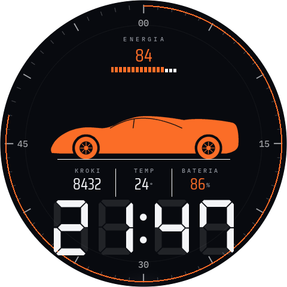

# Nine Eleven — tarcza Wear OS

Tarcza dla **Samsung Galaxy Watch Ultra** (Wear OS 5+ / One UI 6 Watch+), w
**Watch Face Format v2** — deklaratywny XML, zero kodu, mały pakiet, niskie
zużycie baterii.

Wygląd przeniesiony 1:1 z zaakceptowanych makiet TypeScript (osobne, prywatne
repo `wear-os-car-mockups`, komponent `WatchFace.tsx`, "future tech
minimalism"): prawie czarne tło, jeden akcent w kolorze ember,
włosowe linie podziału, drobne, szeroko rozstawione wersaliki. Jedyne
odstępstwo od makiety — na wyraźną prośbę — to godzina w foncie
siedmiosegmentowym (DSEG7) zamiast proporcjonalnego Saira Condensed z makiety.



| Element | Źródło |
| --- | --- |
| Godzina, 24 h, siedmiosegmentowo | `[HOUR_0_23_Z]` : `[MINUTE_Z]` |
| Pierścień minutowy + żywy łuk postępu | `<Arc>` + `Transform` na `[MINUTE]`/`[SECOND]` |
| Kroki | `[STEP_COUNT]` |
| Temperatura | konfigurowalna komplikacja (Samsung Weather) |
| Bateria (zawsze w akcencie, czerwona < 15%) | `[BATTERY_PERCENT]` |
| **Energy score** | slot komplikacji — patrz niżej |
| 8 sylwetek samochodów | `ListConfiguration` |
| 8 kolorów akcentu | `ColorConfiguration` |

---

## Samochody

Osiem sylwetek zainspirowanych rozpoznawalnymi nadwoziami: **Porsche 911**,
**Tesla Cybertruck**, **Dodge Challenger**, **Ford Mustang**, **Bentley
Continental GT**, **Mini Cooper**, **Bugatti Chiron**, **Mercedes G‑Klasa**.

Nazwy modeli są **opisowe i widoczne wyłącznie w edytorze tarczy** (lista
wyboru), nigdy na samej tarczy — dokładnie tak, jak traktuje je kontrakt
`CarSpec.name` w makiecie. Żadna grafika nie zawiera loga, emblematu ani
napisu producenta — to własne ilustracje zbudowane z proporcji charakterystycznych
dla danego stylu nadwozia (rozstaw osi, wysokość linii dachu, zwisy,
wysokość jazdy), nie kalka zdjęcia czy cudzej grafiki.

Każde auto to jedna płaska biała sylwetka + cienka linia detalu (np. rowek
szyby, charakterystyczna „podkowa” Chirona) + koła rysowane programowo
(obręcz, 8 szprych, piasta) — jeden komplet obrazków barwiony `tintColor`
obsługuje wszystkie 8 motywów kolorystycznych.

---

## Energy score — istotne zastrzeżenie

Watch Face Format **nie ma** systemowego źródła danych dla Energy score
Samsung Health. Dostępne źródła zdrowotne to dokładnie `STEP_COUNT`,
`STEP_GOAL`, `STEP_PERCENT`, `HEART_RATE`, `HEART_RATE_Z`
(`tools/wff/xsd/2/common/attributes/sourceType.xsd`). Energy score da się
pokazać wyłącznie przez **komplikację** wystawianą przez Samsung Health.

Sprawdzone bezpośrednio na Galaxy Watch Ultra (`dumpsys package
com.samsung.android.wear.shealth`): Samsung Health rejestruje komplikacje dla
kroków, SpO2, snu, stresu, tętna, ćwiczeń itd. — **ale nie dla Energy score**.
Żaden pakiet w systemie nie wystawia takiego dostawcy. To nie jest błąd w tej
tarczy — provider fizycznie nie istnieje na tym oprogramowaniu.

Slot `ENERGIA` obsługuje `SHORT_TEXT`, `RANGED_VALUE`, `GOAL_PROGRESS` i
`EMPTY`, więc gdy Samsung Health kiedyś zacznie go udostępniać, zadziała bez
zmian. Do tego czasu pole pokazuje `--`, o ile poniższy mostek nie jest
zainstalowany i skonfigurowany.

### `energy-bridge-watch` / `energy-bridge-companion` — własny provider

Ponieważ dostawca nie istnieje, te dwa moduły go **budują**:

* **`energy-bridge-watch`** (na zegarku) — `EnergyScoreComplicationService`
  wystawia się w systemie jako normalny dostawca komplikacji `SHORT_TEXT`.
  `EnergyScoreDataListenerService` nasłuchuje przez Wear OS Data Layer na
  ścieżce `/nine-eleven/energy-score`, zapisuje wartość w
  `EnergyScoreStore` i prosi system o odświeżenie komplikacji.
* **`energy-bridge-companion`** (na telefonie) — jeden przycisk, który
  wysyła wartość przez `Wearable.getDataClient().putDataItem(...)`.

Slot `energy` w `watchface.xml` ma `DefaultProviderPolicy` wskazujący na ten
provider jako domyślny — na testowanym Galaxy Watch Ultra automatyczny wybór
**nie zadziałał** (trzeba raz wskazać „Energy Score” ręcznie w edytorze;
sam kod jest poprawny i zgodny ze specyfikacją WFF).

**Stan zweryfikowany na żywo (18 sierpnia 2026, Galaxy Watch Ultra +
telefon Xiaomi/POCO):**

| Etap | Status |
| --- | --- |
| Provider widoczny i wybieralny w edytorze tarczy | ✅ potwierdzone |
| Telefon → `putDataItem()` → sukces, poprawny węzeł, poprawna ścieżka | ✅ potwierdzone logiem (`putDataItem succeeded: wear://<id>/nine-eleven/energy-score`) |
| Zegarek → `EnergyScoreDataListenerService.onDataChanged()` → zapis do `EnergyScoreStore` | ❌ **nie dociera** — plik `shared_prefs/energy_score.xml` nigdy nie powstaje na zegarku |

Po drodze naprawione zostały trzy prawdziwe błędy:

1. `energy-bridge-watch/.../AndroidManifest.xml` — filtr `<data
   android:pathPrefix="...">` na `intent-filter` z akcją `BIND_LISTENER`.
   Intencja *wiążąca* usługę nigdy nie niesie tego URI, więc taki filtr
   blokował powiązanie usługi w ogóle. Filtrowanie ścieżki należy do kodu
   (`onDataChanged`), nie do manifestu.
2. `energy-bridge-companion` wysyłał na `/energy_score`, `energy-bridge-watch`
   czekał na `/nine-eleven/energy-score` — różne ścieżki, zero szans na
   dopasowanie.
3. UI w `energy-bridge-companion` był niewidoczny (czarny tekst na czarnym
   tle, dziedziczone z `Theme.DeviceDefault` na tym MIUI) — każde
   wcześniejsze dotknięcie trafiało w pustkę, bo przycisku po prostu nie było
   widać.

Mimo tych poprawek dane nie docierają na zegarek. Telefon użyty do testu nie
ma zainstalowanej żadnej aplikacji „Wear OS by Google" (`pm list packages`
nie znajduje `com.google.android.wearable.app` ani podobnych) — parowanie z
Galaxy Watch idzie więc wyłącznie przez most Samsunga (Galaxy Wearable), który
w tym wypadku potwierdza wysyłkę (`putDataItem` zwraca sukces, z poprawnym ID
węzła zegarka), ale najwyraźniej nie w pełni przekazuje dyspozycję
`WearableListenerService` do aplikacji trzecich. To wymaga dalszej
diagnostyki po stronie parowania telefon↔zegarek (sprawdzić, czy telefon ma
zainstalowaną i połączoną aplikację Wear OS by Google), nie kolejnych zmian w
tym kodzie.

Poza tym ograniczeniem `fetchEnergyScoreFromSamsungHealth()` w
`MainActivity.java` to wciąż **zaślepka** zwracająca stałe `85` — czytanie
prawdziwej wartości z Samsung Health wymaga Samsung Health Data SDK (osobna
licencja partnerska) lub odpowiednika w Health Connect, plus przejścia przez
zgody uprawnień na telefonie.

## Temperatura

W przeciwieństwie do Energy score, dostawca **istnieje**: `com.samsung.
android.watch.weather` rejestruje komplikacje `WeatherComplicationService`
(`SHORT_TEXT`/`LONG_TEXT`) oraz osobne dla temperatury odczuwalnej, UV i
opadów. Pole `TEMP` to slot komplikacji z tymi samymi typami — dotknij go w
edytorze i wybierz dostawcę. (Wcześniejsza wersja czytała `[WEATHER.
TEMPERATURE]` na sztywno; to źle działało, bo zależało od uprawnienia
lokalizacji appki Pogoda, a przede wszystkim nie było niczego do wyboru w
edytorze — źródło zamiast slotu.)

---

## Konfiguracja na zegarku

Przytrzymaj tarczę → **Dostosuj**:

* **Kolor** — 8 akcentów (domyślnie *Ember*, `#FB6D27`, jak w makiecie).
* **Samochód** — 8 nadwozi wymienionych wyżej.
* **Complication** → `TEMP` — dotknij, wybierz dostawcę (domyślnie Samsung
  Weather powinien się podpiąć sam; jeśli nie, wybierz ręcznie).
* **Complication** → `ENERGIA` — dotknij, wybierz „Energy Score” **tylko
  jeśli** zainstalowałeś `energy-bridge-watch` (patrz wyżej). Bez tego pola
  nie ma na liście nic sensownego do wyboru i zostaje `--`.

---

## AOD

Czarne tło, auto jako kontur w kolorze akcentu (bez szprych, samo kółko na
kole), zegar nad wygaszonym polem segmentów `88:88`, drobny odczyt baterii
pod zegarem, tylko główne znaczniki pierścienia — zmierzone zużycie: 2,6 MB.

---

## Budowanie i instalacja

```bash
./gradlew :watchface:assembleDebug
```

```bash
adb connect <IP-zegarka>:<port>
```

```bash
adb install -r watchface/build/outputs/apk/debug/watchface-debug.apk
```

APK ma ~557 kB. Na zegarku włącz wcześniej *Opcje programisty* →
*Debugowanie ADB* → *Debugowanie bezprzewodowe*. Port debugowania
bezprzewodowego zmienia się po każdym wygaszeniu ekranu — jeśli `adb connect`
nie łapie połączenia, zeskanuj urządzenie ponownie albo odczytaj port na
ekranie *Debugowanie bezprzewodowe*.

### Opcjonalnie: mostek Energy Score

Dwa dodatkowe moduły — jeden na zegarek, jeden na telefon (patrz sekcja
„Energy score” wyżej o ich obecnym, tylko częściowo zweryfikowanym stanie):

```bash
./gradlew :energy-bridge-watch:assembleDebug :energy-bridge-companion:assembleDebug
```

```bash
adb -s <zegarek> install -r energy-bridge-watch/build/outputs/apk/debug/energy-bridge-watch-debug.apk
adb -s <telefon> install -r energy-bridge-companion/build/outputs/apk/debug/energy-bridge-companion-debug.apk
```

Telefon podłącza się do adb tak samo jak zegarek: *Opcje programisty* →
*Debugowanie bezprzewodowe* → *Sparuj nowe urządzenie* → `adb pair`, potem
`adb connect` na porcie z głównego ekranu tej opcji.

---

## Weryfikacja

Oba narzędzia z repo [`google/watchface`](https://github.com/google/watchface):

```bash
java -jar tools/wff/wff-validator.jar 2 watchface/src/main/res/raw/watchface.xml
```

```bash
java -jar tools/wff/memory-footprint.jar --watch-face watchface/build/outputs/apk/debug/watchface-debug.apk --ambient-limit-mb 10 --active-limit-mb 100
```

Stan: walidacja schematu **PASS**, budżet pamięci **PASS** (2,2 MB aktywny,
2,6 MB ambient), zweryfikowane na żywo na Galaxy Watch Ultra (SM-L705F, Android
16 / One UI 8 Watch) w obu trybach.

---

## Grafika

Nic nie jest zdjęciem ani obrysem cudzej grafiki — wszystko rysowane
proceduralnie:

```bash
python3 tools/gen_art.py
```

**[tools/cars.py](tools/cars.py)** — profile ośmiu nadwozi. Każde auto to
`top_spec` (dach/maska/nos/tył, od jednego koła do drugiego) + `sill`
(wysokość progu) + promień każdego koła. `body()` sam dobudowuje pełną,
zamkniętą sylwetkę, wcinając łuk nadkola przy każdym kole tak, by opona
zawsze siedziała we właściwym wycięciu — pierwsza wersja tego pomijała i
koła "odklejały się" od nadwozia.

**[tools/gen_art.py](tools/gen_art.py)** — rasteryzacja (4× nadpróbkowanie,
Lanczos): paleta (próbkowana z faktycznie wyrenderowanych tokenów oklch
makiety przez canvas w przeglądarce, bo WFF przyjmuje tylko hex), pierścień
minutowy ze znacznikami 00/15/30/45, tło z poświatą, 16-segmentowa maska paska
energii, podgląd.

Ilustracje są własne i **nie zawierają** logotypu, emblematu, nazwy ani
oznaczeń żadnego producenta.

### Strojenie

```python
CAR_BOX = (80, 150, 320, 120)   # x, y, w, h w przestrzeni 480x480
ENERGY_TOP = 62
DIVIDER_Y = 266
METRIC_TOP = 282
TIME_TOP = 334
```

Po zmianie: `python3 tools/gen_art.py`, potem
`./gradlew :watchface:assembleDebug`.

---

## Układ

Przestrzeń projektowa 480×480 — natywna rozdzielczość Ultra, identyczna z
przestrzenią współrzędnych w `WatchFace.tsx`.

```
 y  62..120   energy score
 y 150..270   auto
 y 266        linia
 y 282..322   KROKI | TEMP | BATERIA
 y 334..422   godzina 24 h
```

## Czcionki

* [Saira Condensed](https://fonts.google.com/specimen/Saira+Condensed) — SIL OFL 1.1
* [IBM Plex Mono](https://fonts.google.com/specimen/IBM+Plex+Mono) — SIL OFL 1.1
* [DSEG7 Classic](https://github.com/keshikan/DSEG) — SIL OFL 1.1

Licencje w `licenses/`.
